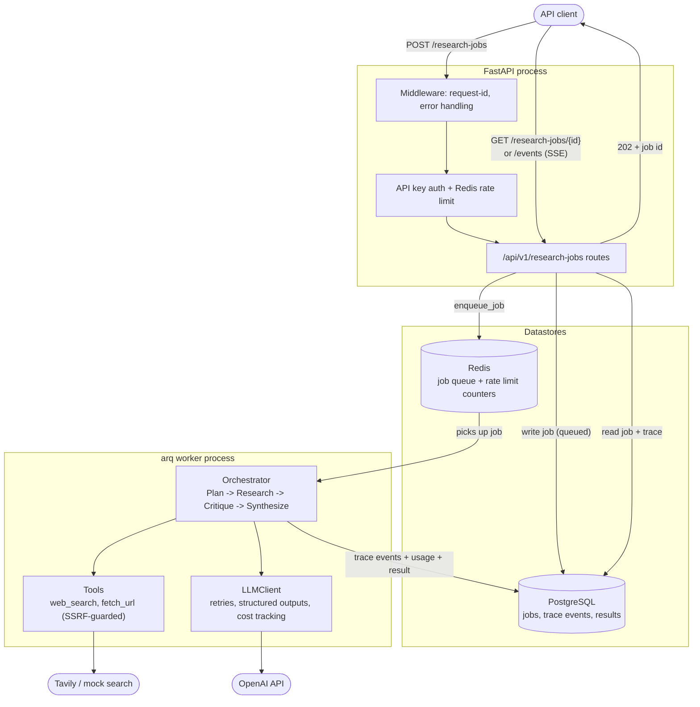
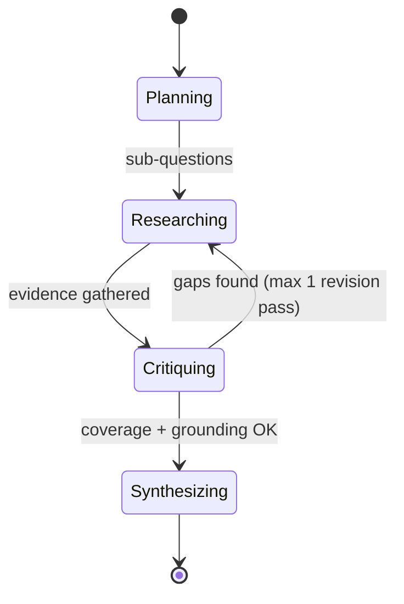

# Architecture

## System overview



## Why an async job, not a synchronous endpoint

A thorough research run makes 5-15+ sequential LLM calls and tool calls and
can take 30 seconds to a few minutes. Blocking an HTTP request for that long
is the wrong shape for an API: it ties up a connection, fights load-balancer
and client timeouts, and gives the caller no way to observe progress. The
API instead:

1. Validates the request, persists a `research_jobs` row with
   `status=queued`, and returns `202 Accepted` with the job ID immediately.
2. Enqueues the job onto Redis via [arq](https://github.com/samuelcolvin/arq).
3. A separate worker process picks the job up, runs the orchestrator against
   it, and updates the job's status/phase/trace as it goes.
4. The client polls `GET /research-jobs/{id}` or subscribes to
   `GET /research-jobs/{id}/events` (Server-Sent Events) for live progress.

## Layering

```
api/       <- HTTP only: request/response shapes, auth, rate limiting
services/  <- use-case orchestration: job lifecycle, DB-backed trace sink
agent/     <- the actual agent reasoning (framework-agnostic, DB-agnostic)
llm/ tools/ <- adapters: OpenAI client, search/fetch tools
db/        <- persistence
```

Each layer only depends on the layers below it. In particular, `agent/`
never imports anything from `db/` or `api/` -- it reports everything it does
through the `TraceSink` protocol (`agent/state.py`), and `services/`
provides the concrete, Postgres-backed implementation
(`DbTraceSink`). This is what makes the orchestrator unit-testable with an
in-memory sink and no database (see `tests/unit/test_orchestrator.py`), and
what would let the same agent code run inside a different host (a CLI, a
Slack bot) without modification.

## The agent state machine



- **Planning**: one structured-output call turns the query into 3-5
  searchable sub-questions.
- **Researching**: a ReAct-style tool-calling loop (`web_search`,
  `fetch_url`) runs until the model volunteers a summary with no further
  tool calls, or the step budget (`AGENT_MAX_TOOL_STEPS`) is exhausted.
- **Critiquing**: a structured-output call judges whether the gathered
  evidence actually covers the sub-questions and is properly grounded
  (not vague/tangential). If not, it proposes targeted follow-up queries
  and the orchestrator runs one more bounded research pass
  (`AGENT_MAX_REVISION_LOOPS`, default 1).
- **Synthesizing**: a final structured-output call writes the Markdown
  report, citing sources by the numeric ID the `EvidenceStore` already
  assigned -- the model is never allowed to invent its own source list.

## Cost and safety controls

An autonomous, tool-using agent given an ambiguous query is a classic way
to accidentally spend a lot of money very quickly, or to have a tool fetch
somewhere it shouldn't. This project bounds that at three independent
layers:

| Control | Where | What it prevents |
|---|---|---|
| `AGENT_MAX_TOOL_STEPS` | `research_loop.py` | Unbounded tool-call loops |
| `AGENT_MAX_TOKENS_PER_JOB` | `orchestrator.py` (`_UsageTracker`) | Runaway token spend across all phases of one job |
| `AGENT_JOB_TIMEOUT_SECONDS` | `orchestrator.py` (`asyncio.wait_for`) | A job hanging forever on a slow/stuck call |
| SSRF guard | `tools/ssrf_guard.py` | The agent fetching an internal/cloud-metadata address from a URL it chose itself |
| Per-key rate limit | `api/deps.py` (`enforce_rate_limit`) | One API key flooding the job queue |

See [ADR 0005](decisions/0005-cost-and-safety-caps.md) and
[ADR 0004](decisions/0004-ssrf-guard.md) for the reasoning behind each.

## Observability

Every LLM call, tool call, and phase transition is written as a
`TraceEvent` row (`db/models.py`) as it happens -- not batched at the end --
specifically so a failed or timed-out job still leaves a full trace of what
it did up to that point (see `DbTraceSink` in `services/research_service.py`,
which commits after every event). That trace is:

- Queryable via `GET /research-jobs/{id}` (full job + result) and streamed
  live via `GET /research-jobs/{id}/events` (SSE).
- Structured JSON logs (via `structlog`) carry a `request_id` bound for the
  lifetime of each HTTP request (`api/middleware.py`), so logs from a single
  request can be correlated even though they're emitted from deep inside a
  service/repository call.

Not yet implemented (documented here rather than silently skipped): a
Prometheus `/metrics` endpoint and distributed tracing (OpenTelemetry) --
the trace-event table and structured logs cover this project's needs, but a
real production deployment at higher scale would want both.
